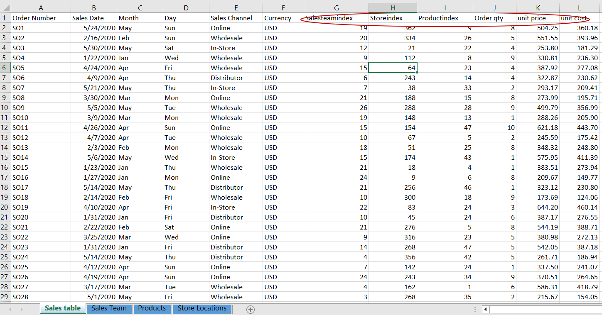
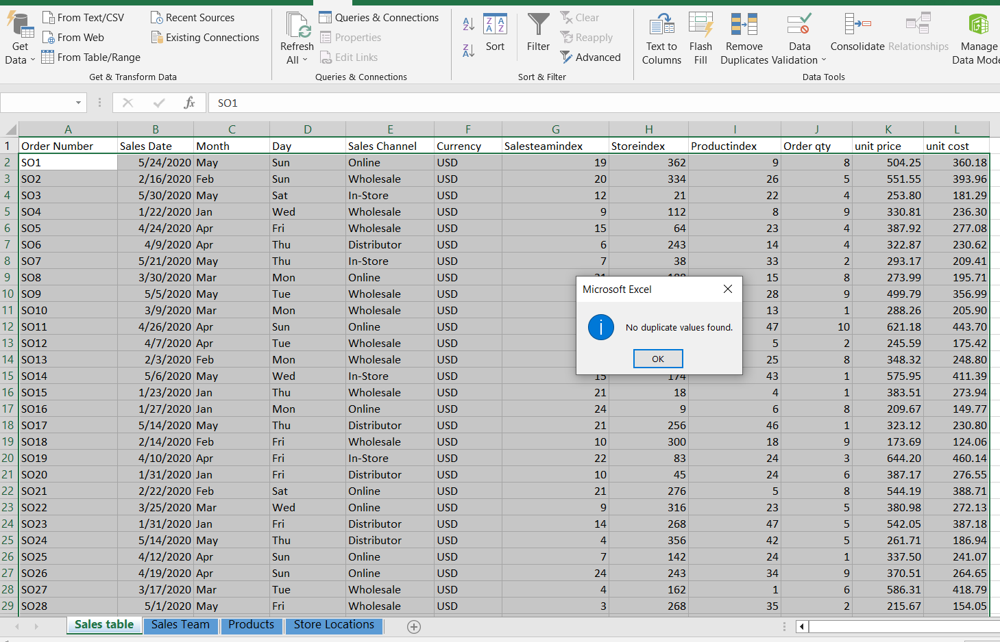
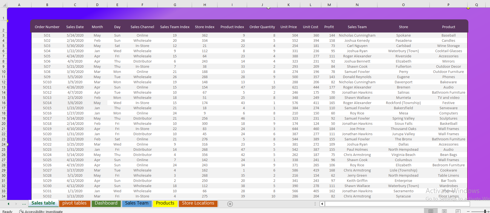
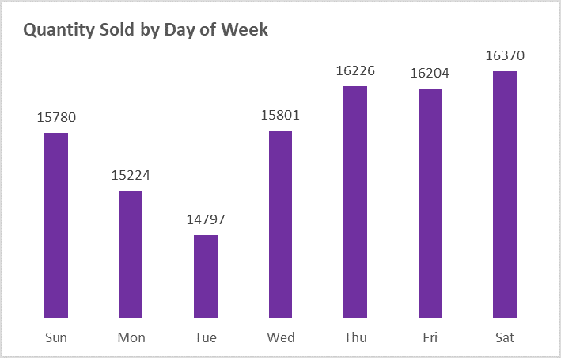
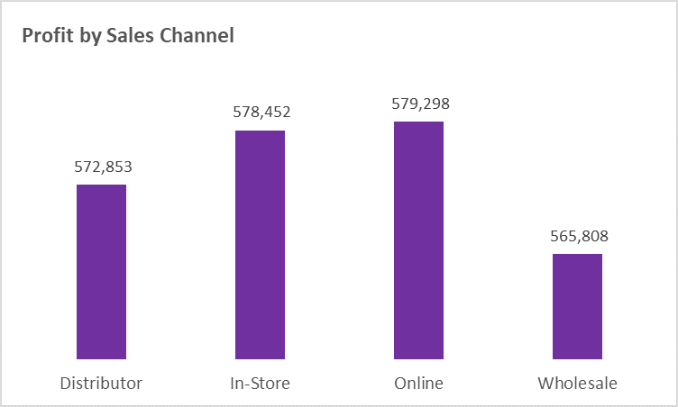
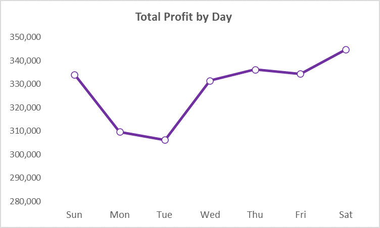

# Executive Sales Report
## Author : Millicent Ofobuike
### Data Date: 01-01-2020 – 31-05-2020.

## Background of Data
The dataset is a public data made available by Maven Analytics. To improve my knowledge of Microsoft Excel, Excel was chosen for analysis and visualization.
The dataset was downloaded and saved. The columns and rows were checked to understand the dataset. The workbook has 4 sheets (sales table, sales team, store locations and products). A working database of the dataset was created and this is what was worked on. 

The **Sales Table** sheet has 10 columns and 20,001 rows with each row representing a specific order of product including the product type,the quantity sold, the team that sold it and the day it was sold. The **Sales Team** sheet contains sales team index and their names with 3 columns and 29 rows. The **Products** sheet has 2 columns and 49 rows representing product id and product names. The **Store Locations** sheet contains 15 columns and 368 rows representing store Id, store names, county, state, etc
We can see there are structural errors.

## Data Cleaning

The highlighted column names were renamed to Sales Team Index, Store Index, Product Index, Order Quantity, Unit Price and Unit Cost for easier understanding. 
The data types were checked. Sales Date was changed from General to Short Date. Order Quantity was changed from General to Number. The Unit Price and Unit cost columns were rounded off to remove decimals.
To verify if there were duplicates, all rows and columns were selected, and the remove duplicates ribbon was clicked on. Zero duplicates was found. This means there is no duplicated data.

The filter ribbon was used to filter each column, on each column, blank cells and misspelt words were checked for and there was none.  

## Data Analysis
New columns (profit, Day and month) were created. Profit column was created by subtracting column Unit price from column unit cost. Day and month were extracted by using the day and month extraction functions **=TEXT(B2,”ddd”)** and **=TEXT(B2,”mmm”)**.
Since the Sales Table contains sales team index, store locations index and product index, the VLOOKUP function was used to get the values from their respective sheets and new columns: Sales Team, Store and product columns were added to the table.

To insert pivot tables, a table containing all cells was created and the table style was changed to none. To make the table more presentable, the cell heights were adjusted and colors were added to the background.

Pivot tables and dashboard sheets were created.

The result was visualized using Excel. 

## Observations
